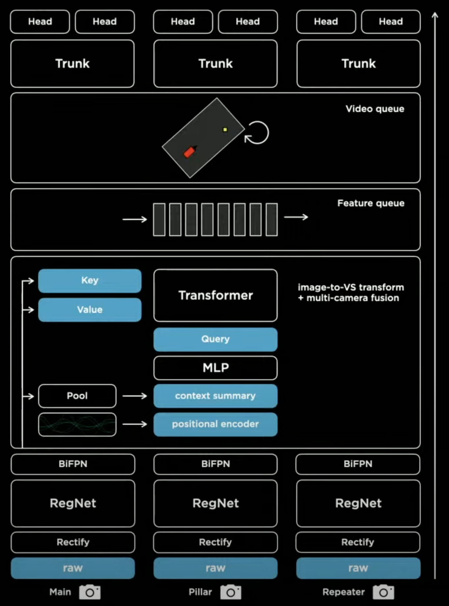

# Materials for Learning Autopilot

There is no doubt that Tesla's Autopilot is great, if you want to learn it's technical details, then you've come to the right place!

**Network Architecture**

## Papers

+ [RestNet - Deep Residual Learning for Image Recognition](https://arxiv.org/pdf/1512.03385.pdf)
+ [RegNets - Designing Network Design Spaces](https://arxiv.org/pdf/2003.13678.pdf)
+ [EfficientDet - Scalable and Efficient Object Detection](https://arxiv.org/pdf/1911.09070.pdf)
+ [Transformer - Attention Is All You Need](https://arxiv.org/pdf/1706.03762.pdf)

## Articles

+ [FSD Chip - Tesla](https://en.wikichip.org/wiki/tesla_(car_company)/fsd_chip)

## Videos（sort by time）

+ [Tesla AI Day 2021](https://www.youtube.com/watch?v=j0z4FweCy4M)
+ [CVPR 2021 Workshop on Autonomous Vehicles - Andrej Karpathy](https://www.youtube.com/watch?v=NSDTZQdo6H8)
+ [Scalability in Autonomous Driving - Andrej Karpathy](https://www.youtube.com/watch?v=g2R2T631x7k)

+ [AI for Full-Self Driving at Tesla - Andrej Karpathy](https://www.youtube.com/watch?v=hx7BXih7zx8)

+ [Tesla Autopilot and Multi-Task Learning for Perception and Prediction - Andrej Karpathy](https://www.youtube.com/watch?v=IHH47nZ7FZU)

+ [PyTorch at Tesla - Andrej Karpathy](https://www.youtube.com/watch?v=oBklltKXtDE)

+ [Tesla Autonomy Day 2019](https://www.youtube.com/watch?v=Ucp0TTmvqOE)

+ [Deep Learning for Computer Vision - Andrej Karpathy](https://www.youtube.com/watch?v=u6aEYuemt0M)

## Code

WIP

Of course we can't see the source code of autopilot, but we can write some demo code based on it's technology. 
